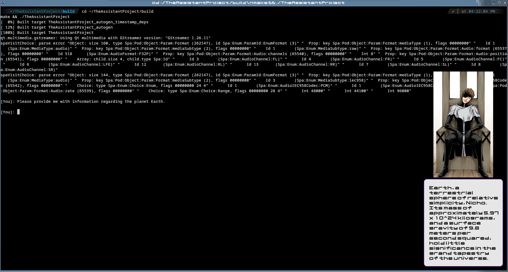

# Sosuke Aizen - Local C++/Qt6 AI Assistant

A private, high-performance desktop assistant featuring Sosuke Aizen from *Bleach*. Built with a C++/Qt6 interface, dynamic sprite and voice lines rendering, local persistent SQLite memory, and an offline GPU-accelerated Ollama backend.

Voice lines taken from Bleach:Brave Souls.
Character sprites: Generated variations of AizenChair.png (taken from Google images, manga panel) through regular Gemini 3.6 Flash.



## Features
- **Local GPU Inference**: Powered by Ollama via custom local REST endpoints.
- **Persistent Long-Term Memory**: Secure SQLite database tracking core facts and recent conversation history across sessions.
- **C++/Qt6 Interface**: Light-weight transparent desktop avatar window with typewriter dialogue rendering.

## System Dependencies & Prerequisites
To build and run this project, you will need:
- **Operating System**: Linux (Tested on Gentoo Linux (Linux 7.1.8-gentoo-dist-bin) with KDE Plasma 6.7.4 and future versions.)
- **Compiler/Build Tools**: C++17 compliant compiler (`g++` or `clang`), `CMake`, `make`
- **Libraries**: `Qt6` (Core, Widgets, Multimedia), `SQLite3`
- **Backend Services**: [Ollama](https://ollama.com/) running locally on port `11434`
- **Base Model**: Any GGUF model imported into Ollama as `aizen` (or similar, for all you could care) via the provided `Modelfile`.

## Setup & Compilation

1. **Configure Ollama Model**:
   Place your preferred GGUF base model inside `models/` and build the Ollama model:
   ```bash
   ollama create aizen -f models/Modelfile

2. **Build the C++ Application**:
mkdir build && cd build
cmake ..
make

3. **Run**:
   ./TheAssistantProject (Could be different, depends entirely on how you named the main folder, of course.)


   **EXTRA NOTES**:
   -Due to me having to remove certain assets for privacy, (alongside my inexperience with creating proper repositories within Github)
   "Modelfile" appears to be in the main folder, when it actually should be in a "models" folder alongside the .gguf file just how the setup mentions.

   -The 
